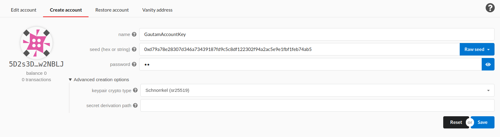
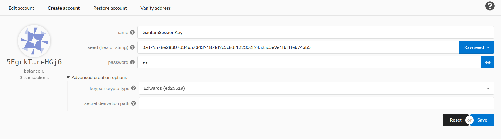
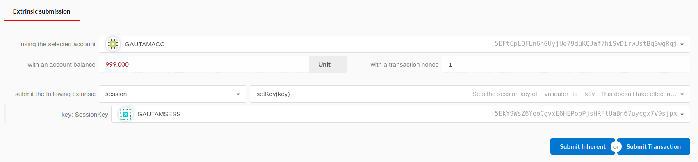
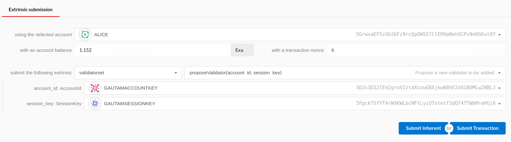
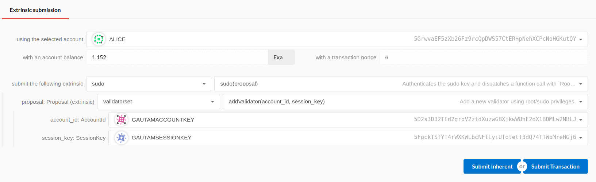

# Substrate PoA setup & ValidatorSet module

A Substrate runtime which allows addition of new validators in a pure PoA fashion. No tokens or stake needed, just the authorities have to agree. This is mainly for semi-trusted consortium chain scenarios where the validators are generally known entities.

The runtime includes a module called `ValidatorSet` which is an abstraction on top of the SRML `session` module. It adds logic to propose and add new validators; something similar to how the ValidatorSet contract in Parity Ethereum works.

**NOTE: This PoA runtime sample is built on and compatible with the Substrate 1.0 version only. Please do not use it with any later versions or current master of Substrate.**

## Usage

* Clone this repo and `cd` into it.

* Set the `ValidatorSet` genesis config in the `src/chain_spec.rs` file.
The genesis config takes a list of validators. Each validator is represented by a combination of AccountKey (sr25519) and AuthorityKey (ed25519).

```rust
validatorset: Some(ValidatorSetConfig {
	validators: vec![
		(account_key("Alice"), authority_key("Alice")), 
		(account_key("Bob"), authority_key("Bob"))
	]
}),
```

**IMP:** The authority keys here are the session keys for the authorities and they should be exactly the same as what we have set in the genesis config of the `consensus` module. Basically, in the `ValidatorSet` module's genesis config, we are associating an AccountKey with the SessionKey of each authority.

For simplicity and easy reuse of same values across genesis config of several modules, we have defined a vec with the initial values and used it thereafter. See the `testnet_genesis` function in the `chain_spec.rs` file for more details.

* Build Wasm runtime using `./scripts/build.sh`.

* Build the Rust binary using `cargo build --release`.

* Run the first validator node by running the following command.

```
./target/release/substrate-poa --chain local --validator --key //Alice --port 30331 --base-path ~/tmp/a
```

**Note:** The `port` and `base-path` are set to custom values because we intend to run more than one nodes on the same machine for this example. You can choose not to set these params when you are running nodes on different machines.

* Run the second node by running the following command.

```
./target/release/substrate-poa --chain local --validator --key //Bob --port 30332 --base-path ~/tmp/b
```

> Notice the change in the `key` parameter in the above two commands. Also notice that we have passed the exact same keys which we had set in the genesis config.

**Note:** When running the node using a config other than `dev` we need at least two validator nodes for production of blocks to start. 

With the above commands executed, we would have two nodes running on the same machine and they should produce blocks.

## Addition of validators

Follow these steps to add a new validator to the chain.

### 1. Create new account and session keys

Connect any of the running nodes to the Polkadot Apps portal and create a new set of account and session keys which can be used for the new validator.

* Create Account Key:



* Create Session Key:



**Note:** You can do this using the `subkey` tool as well.

### 2. Associate the account and session keys in the session module

Because the `ValidatorSet` module depends on the `session` module, it is important to associate the account and session keys in the `session` module before we can add a new validator using the `ValidatorSet` module.

In the extrinsics section of the Polkadot Apps portal, call the `set_key` function of the `session` module by using the account key generated in the previous step as the signing key for this extrinsics call. Use the session key generated in the previous step as the parameter of the `set_key` function. See the following screenshot for reference.



### 3. Add a new validator using proposal process

Go the extrinsics section of the Polkadot Apps portal and select one of the existing validator account keys in the `using the selected account` dropdown. This is the key using which the extrinsic would be signed.

Select `validatorset` as the extrinsic section and select `proposeAddValidator` as the function. Then select the newly created account and session key as the parameters. See the following screenshot for reference.



Click `Submit Transaction`.

* Repeat the above step using all existing validator accounts.

**Note:** For simplicity, we have made all validators required to propose the new validator. As an enhancement, this can be made `m of n` or any other threshold and can be made configurable too.

* Once all validators have completed the `proposeAddValidator` step, call the `resolveAddValidator` function from any of the existing validators.


When the `resolveAddValidator` extrinsic is finalized, the runtime should emit an event `ValidatorAdded`.

* Run another validator node with the seed of the newly created session key as the `key` parameter.

```
./target/release/substrate-poa --chain local --validator --key 0xd79a78e28307d346a73439187fd9c5c8df122302f94a2ac5e9e1fbf1feb74ab5 --port 30336 --base-path ~/tmp/g
```

If all went well, the new validator should sync and should be able to produce blocks.

Following the exact same steps, you can add more validators to the chain.

**Note:** If you are running these nodes on separate machines then you should also add the `bootnodes` parameter with the address of one of the previously running nodes.

### Add a new validator using Sudo

The `ValidatorSet` module also includes a function `addValidator` which can be used to add a new validator using the sudo function. This approach does not require all validators to propose the new validator. The new validator is added directly because of the root priviledges of the sudo function. See the following screenshot for reference.



## Validator removal

Existing validators can be removed by following the exact same process - either using proposals or sudo.

To remove a validator using proposals, use the `propose_validator_removal` and `resolve_remove_validator` functions similar to the proposal process for addition of validators described above. All **other** validators should propose the removal of same validator and only after that the `resolve_remove_validator` function can be called.

To remove a validator using sudo, simply call the `remove_validator` function using the sudo key.

## Important Note

* The Substrate framework, related libraries and APIs are rapidly evolving. In case this module does not work with the latest Substrate build, please submit an issue in this repo.
You can also try porting the runtime module into a freshly cloned `substrate-node-template` codebase.

* This code not audited and reviewed for production use cases. You can expect bugs and security vulnerabilities. Do **not** use it as-is in real applications.
